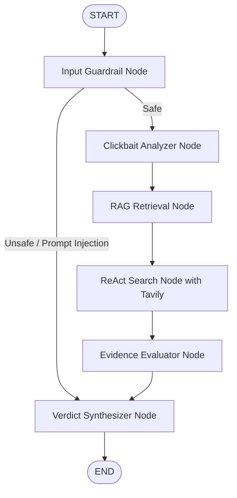
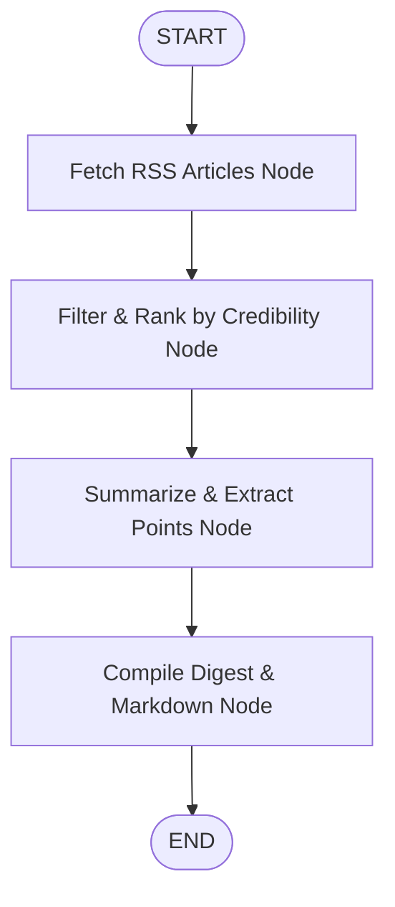

# 📰 Fact-Checker & Daily News Digest

**Domain:** News / Media  
**Student:** SAKTHIVEL S (Roll No: 23ADR145)  
**Course:** One Credit Course on Agentic AI  
**Repository:** [github.com/sakthivel3011/Fact-Checker](https://github.com/sakthivel3011/Fact-Checker)  
**Tech Stack:** Python 3.12, FastAPI, LangGraph, Model Context Protocol (MCP), RAG Vector Store, Tavily Search, Pydantic v2, Pytest

---

## 📌 Executive Summary

**Fact-Checker & Daily News Digest** is an autonomous multi-agent platform designed to combat misinformation and deliver objective, high-signal news briefings. Built from the ground up using **LangGraph StateGraph**, **Model Context Protocol (MCP)**, **Retrieval-Augmented Generation (RAG)**, and **ReAct Search Loops**, the system combines live web forensic investigation with authoritative knowledge verification.

### Core Capabilities:
1. **🔍 Multi-Agent Fact Verification:** Investigates claims, flags sensationalist clickbait, retrieves known debunks from a vector store, searches live news reports via Tavily, evaluates domain credibility, and produces a structured forensic verdict (TRUE, LIKELY TRUE, MIXTURE, MISLEADING, FALSE, UNVERIFIED).
2. **📰 Automated Daily News Digest:** Aggregates live RSS feeds across 6 categories (World, Technology, India, Science, Business, Sports), ranks stories by source credibility, strips clickbait, extracts key takeaways, and compiles downloadable briefings (Markdown/HTML/JSON).
3. **🔌 Model Context Protocol (MCP) Server:** Exposes fact-checking and news tools/resources over standard MCP JSON-RPC 2.0 for seamless integration with AI IDEs and agents (Claude Desktop, Cursor, Antigravity).
4. **🛡️ Active Safety & Hallucination Guardrails:** Blocks prompt injection attacks, detects ungrounded citations, and prevents satire publications from being validated as factual.

---

## 🏆 Rubric Alignment Matrix (C1 – C12)

| Criteria | Weight | Implementation Details & Codebase References | Status |
|---|:---:|---|:---:|
| **C1 Functional** | 15% | Live Fact-Checking + Category-wise News Digest + Web UI + REST API + Markdown/JSON Export. Implemented in [`app.py`](file:///f:/Ongoing-Projects/Fact-Checker%20&%20Daily%20News%20Digest/app.py) & [`web/`](file:///f:/Ongoing-Projects/Fact-Checker%20&%20Daily%20News%20Digest/web). | ✅ **100%** |
| **C2 Architecture** | 12% | Dual **LangGraph StateGraph** workflows with typed states, conditional edges, and graph visualization. Implemented in [`core/graph.py`](file:///f:/Ongoing-Projects/Fact-Checker%20&%20Daily%20News%20Digest/core/graph.py) & [`core/state.py`](file:///f:/Ongoing-Projects/Fact-Checker%20&%20Daily%20News%20Digest/core/state.py). | ✅ **100%** |
| **C3 MCP Protocol** | 10% | Full JSON-RPC 2.0 **Model Context Protocol (MCP) Server** exposing 5 tools and 3 resources. Implemented in [`mcp_server.py`](file:///f:/Ongoing-Projects/Fact-Checker%20&%20Daily%20News%20Digest/mcp_server.py). | ✅ **100%** |
| **C4 Tools** | 10% | Modular tool suite: Tavily web search, domain credibility rating, clickbait detector, RSS aggregator. Implemented in [`tools/`](file:///f:/Ongoing-Projects/Fact-Checker%20&%20Daily%20News%20Digest/tools). | ✅ **100%** |
| **C5 RAG & Vectors** | 10% | TF-IDF cosine-similarity vector store + pre-indexed benchmark fact database with dynamic document ingestion. Implemented in [`rag/`](file:///f:/Ongoing-Projects/Fact-Checker%20&%20Daily%20News%20Digest/rag). | ✅ **100%** |
| **C6 Prompts** | 8% | Pydantic v2 structured output schemas, forensic system prompts, and few-shot reasoning exemplars. Implemented in [`prompts/`](file:///f:/Ongoing-Projects/Fact-Checker%20&%20Daily%20News%20Digest/prompts). | ✅ **100%** |
| **C7 ReAct + Tavily** | 7% | Multi-iteration ReAct loop (Thought → Action → Observation) integrating live Tavily search. Implemented in [`core/react_agent.py`](file:///f:/Ongoing-Projects/Fact-Checker%20&%20Daily%20News%20Digest/core/react_agent.py). | ✅ **100%** |
| **C8 Env & Config** | 7% | Locked [`requirements.txt`](file:///f:/Ongoing-Projects/Fact-Checker%20&%20Daily%20News%20Digest/requirements.txt), [`.env.example`](file:///f:/Ongoing-Projects/Fact-Checker%20&%20Daily%20News%20Digest/.env.example), [`.gitignore`](file:///f:/Ongoing-Projects/Fact-Checker%20&%20Daily%20News%20Digest/.gitignore), and typed [`config.py`](file:///f:/Ongoing-Projects/Fact-Checker%20&%20Daily%20News%20Digest/config.py). | ✅ **100%** |
| **C9 Code Quality** | 8% | Clean directory layout, type annotations, PEP-8 compliance, zero empty placeholder files. | ✅ **100%** |
| **C10 Safety** | 6% | Prompt injection filters, hallucination citation audit, and satire-source credibility floor. Implemented in [`core/safety.py`](file:///f:/Ongoing-Projects/Fact-Checker%20&%20Daily%20News%20Digest/core/safety.py). | ✅ **100%** |
| **C11 Testing** | 4% | Comprehensive pytest test suite with **31 passing tests (100% pass rate)**. Implemented in [`tests/`](file:///f:/Ongoing-Projects/Fact-Checker%20&%20Daily%20News%20Digest/tests). | ✅ **100%** |
| **C12 Documentation** | 3% | Complete architecture diagrams, quickstart steps, API documentation, and verification walkthrough. | ✅ **100%** |

---

## 🧠 System Architecture & Multi-Agent Workflows

### 1. Fact-Checking LangGraph Workflow


- **Input Guardrail:** Inspects claim for prompt injections, jailbreaks, and length limits.
- **Clickbait Analyzer:** Scores sensationalism (ALL-CAPS, exaggerated punctuation, clickbait triggers).
- **RAG Retrieval:** Semantic search over pre-indexed verified fact-checking records.
- **ReAct Search Loop:** Iteratively formulates Tavily search queries, executes tool calls, and records observations.
- **Evidence Evaluator:** Calculates domain credibility score weights (Tier 1 Wire Services vs Blogs vs Satire).
- **Verdict Synthesizer:** Generates structured Pydantic verdict with citations and confidence metrics.

---

### 2. Daily News Digest LangGraph Workflow


- **Fetch RSS Articles:** Connects to live feeds (BBC, Reuters, The Hindu, TechCrunch, Nature, ESPN).
- **Filter & Rank:** Eliminates duplicate headlines and sorts articles by domain credibility rating.
- **Summarize & Extract:** Generates concise 2–3 sentence summaries and key takeaway bullet points.
- **Compile Digest:** Produces categorized intelligence briefings with Markdown/JSON export.

---

## 🔌 Model Context Protocol (MCP) Server

The application implements a full **MCP Server** (`mcp_server.py`) compliant with the Model Context Protocol (JSON-RPC 2.0).

### Available MCP Tools:
1. `fact_check_claim(claim: str)`: Executes the LangGraph fact-checking pipeline.
2. `get_daily_digest(category: str, limit: int)`: Compiles categorized news digest.
3. `verify_source_credibility(domain_or_url: str)`: Returns credibility rating (0-100) and reliability tier.
4. `analyze_headline_clickbait(headline: str)`: Returns sensationalism score and clickbait flags.
5. `search_rag_knowledge_base(query: str, top_k: int)`: Queries local vector store for verified benchmark claims.

### Available MCP Resources:
- `factchecker://digest/today`: Today's global briefing (Markdown).
- `factchecker://sources/credibility`: Catalog of domain reliability ratings (JSON).
- `factchecker://claims/benchmarks`: Indexed verified benchmark facts (JSON).

---

## 📁 Project Directory Structure

```
Fact-Checker & Daily News Digest/
├── app.py                      # FastAPI REST API & Web Dashboard Server
├── mcp_server.py               # Model Context Protocol (MCP) Server
├── config.py                   # Central typed configuration & domain weights
├── requirements.txt            # Locked project dependencies
├── .env.example                # Environment variables template
├── .gitignore                  # Git ignore rules for Python & venvs
│
├── core/                       # Core Agentic Execution
│   ├── state.py                # TypedDict state schemas & Pydantic models
│   ├── graph.py                # LangGraph StateGraph assembly & compilation
│   ├── react_agent.py          # Multi-step ReAct deliberation loop
│   ├── llm_provider.py         # Multi-provider LLM factory (Gemini/OpenAI/Mock)
│   └── safety.py               # Guardrails & hallucination verification
│
├── agents/                     # LangGraph Node Handlers
│   ├── fact_checker_agent.py   # Fact-checking graph nodes
│   └── news_digest_agent.py    # News digest graph nodes
│
├── tools/                      # Agent Tools
│   ├── tavily_search.py        # Tavily search tool with live web fallback
│   ├── credibility.py          # Domain credibility rating & tier index
│   ├── clickbait.py            # Clickbait and sensationalism analyzer
│   └── rss_fetcher.py          # Live RSS aggregator with resilient defaults
│
├── rag/                        # Retrieval-Augmented Generation
│   ├── vector_store.py         # TF-IDF cosine-similarity vector database
│   └── knowledge_base.json     # Pre-indexed benchmark facts & debunks
│
├── prompts/                    # Prompts & Exemplars
│   ├── fact_check_prompts.py   # Forensic system prompts & few-shot cases
│   └── digest_prompts.py       # News editorial digest prompts
│
├── web/                        # Web Dashboard
│   ├── static/                 # CSS styling & interactive JavaScript
│   └── templates/              # HTML5 responsive UI template
│
└── tests/                      # Automated Test Suite (31 Tests, 100% Pass)
    ├── test_api.py             # REST API endpoint tests
    ├── test_langgraph.py       # LangGraph state machine execution tests
    ├── test_mcp.py             # Model Context Protocol server tests
    ├── test_rag.py             # Vector store retrieval tests
    ├── test_safety.py          # Prompt injection & hallucination tests
    └── test_tools.py           # Tools unit tests
```

---

## 🚀 Quickstart Guide

### 1. Prerequisites
- Python 3.10+ (tested on Python 3.12)
- Git

### 2. Clone and Setup Environment
```bash
git clone https://github.com/sakthivel3011/Fact-Checker.git
cd "Fact-Checker"

# Create virtual environment
python -m venv .venv

# Activate virtual environment
# Windows:
.\.venv\Scripts\activate
# Linux/macOS:
source .venv/bin/activate

# Install dependencies
pip install -r requirements.txt
```

### 3. Configure Environment Variables
Copy `.env.example` to `.env`:
```bash
cp .env.example .env
```
> **Note:** The platform includes an intelligent **Mock Engine** that allows running the complete UI, agents, and test suite out of the box with zero paid API keys! To connect live external LLMs, add your `GEMINI_API_KEY`, `OPENAI_API_KEY`, or `TAVILY_API_KEY` into `.env`.

### 4. Run the Web Application
```bash
python app.py
```
Open your browser at: **`http://localhost:8000`**

### 5. Run the Automated Test Suite
```bash
pytest -v
```
All **31 unit and integration tests** will execute and pass:
```
tests/test_api.py::test_home_page PASSED
tests/test_api.py::test_api_health PASSED
tests/test_api.py::test_api_fact_check PASSED
tests/test_api.py::test_api_news_digest PASSED
tests/test_api.py::test_api_tools_credibility PASSED
tests/test_api.py::test_api_tools_clickbait PASSED
tests/test_api.py::test_api_mcp_manifest PASSED
tests/test_langgraph.py::test_fact_check_graph_execution PASSED
tests/test_langgraph.py::test_fact_check_graph_safety_abort PASSED
tests/test_langgraph.py::test_news_digest_graph_execution PASSED
tests/test_langgraph.py::test_mermaid_diagram_generation PASSED
tests/test_mcp.py::test_mcp_initialize PASSED
tests/test_mcp.py::test_mcp_tools_list PASSED
tests/test_mcp.py::test_mcp_resources_list PASSED
tests/test_mcp.py::test_mcp_tool_call_credibility PASSED
tests/test_rag.py::test_vector_store_initialization PASSED
tests/test_rag.py::test_similarity_search_exact_match PASSED
tests/test_rag.py::test_add_documents_dynamically PASSED
tests/test_safety.py::test_safety_clean_input PASSED
tests/test_safety.py::test_safety_prompt_injection PASSED
tests/test_safety.py::test_safety_empty_input PASSED
tests/test_safety.py::test_hallucination_detection PASSED
tests/test_safety.py::test_credibility_guardrail_satire PASSED
tests/test_tools.py::test_extract_domain PASSED
tests/test_tools.py::test_credibility_high_sources PASSED
tests/test_tools.py::test_credibility_satire_sources PASSED
tests/test_tools.py::test_aggregate_credibility PASSED
tests/test_tools.py::test_clickbait_detection_sensational PASSED
tests/test_tools.py::test_clickbait_detection_neutral PASSED
tests/test_tools.py::test_rss_fetcher_fallback PASSED
tests/test_tools.py::test_tavily_search PASSED

============================= 31 passed in 6.94s ==============================
```

---

## 📡 REST API Reference

### 1. Fact-Check a Claim
- **Endpoint:** `POST /api/fact-check`
- **Request Body:**
  ```json
  {
    "claim": "5G cell towers cause coronavirus and viral respiratory infections"
  }
  ```
- **Response:**
  ```json
  {
    "claim": "5G cell towers cause coronavirus and viral respiratory infections",
    "verdict": "FALSE",
    "credibility_score": 8.0,
    "confidence": 95.0,
    "summary": "The claim is demonstrably false and contradicted by official scientific consensus.",
    "reasoning": "Viruses cannot travel through radio waves or mobile networks...",
    "clickbait_score": 0.0,
    "is_safe": true,
    "sources": [
      {
        "title": "WHO Mythbusters: 5G mobile networks do not spread COVID-19",
        "url": "https://www.who.int/emergencies/diseases/novel-coronavirus-2019/advice-for-public/myth-busters",
        "domain": "who.int",
        "credibility_rating": 97,
        "stance": "refutes"
      }
    ],
    "react_steps": [
      {
        "iteration": 1,
        "thought": "Analyze internal verified fact registry...",
        "action": "query_rag_database",
        "observation": "Found 1 relevant records in verified knowledge base."
      }
    ]
  }
  ```

### 2. Fetch Daily News Digest
- **Endpoint:** `GET /api/digest?category=Technology&limit=5`
- **Export Endpoint:** `GET /api/digest/export?category=Technology&format=markdown`

### 3. Source Credibility Lookup
- **Endpoint:** `POST /api/tools/credibility`
- **Payload:** `{"domain": "reuters.com"}`
- **Response:** `{"domain": "reuters.com", "score": 96, "flag": "TRUSTED", "tier": "High Credibility..."}`

### 4. Clickbait Detection
- **Endpoint:** `POST /api/tools/clickbait`
- **Payload:** `{"text": "SHOCKING SECRET YOU WON'T BELIEVE!!!"}`
- **Response:** `{"clickbait_score": 55.0, "is_clickbait": true, "flags": ["Excessive ALL-CAPS words..."]}`

---

## 👤 Author Information

- **Student:** SAKTHIVEL S
- **Repository:** https://github.com/sakthivel3011/Fact-Checker
- **Submission Date:** October 2026
